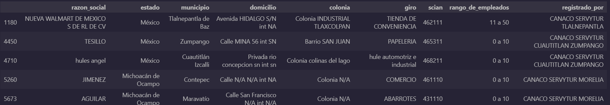

# 📊 Sistema de Información Empresarial Mexicano (SIEM)
# Análisis Empresaral Mexicano SIEM 2024

---

## 📚 Tabla de Contenidos

- [🎯 Propósito](#-propósito)
- [📦 Conjunto de Datos](#-conjunto-de-datos)
- [🧪 Desarrollo del Proyecto](#-desarrollo-del-proyecto)
- [📈 Conclusiones y Recomendaciones](#-conclusiones-y-recomendaciones)
- [🛠️ Tecnologías](#-tecnologías)
- [⚙️ Instalación](#-instalación)
- [👤 Autores](#-autores)

---

## 🎯 Propósito

Analizar la distribución y características de las empresas registradas en el Sistema de Información Empresarial Mexicano (SIEM) para obtener insights sobre su localización, tamaño, sector económico predominante y diferencias regionales, usando técnicas estadísticas y visualización de datos.

---

## 📦 Conjunto de Datos

El conjunto de datos utilizado contiene las siguientes columnas:

- `_id`: Identificador único del registro	
- `razon_social`: Nombre de la empresa o establecimiento
- `estado`: Estado de la República Mexicana	
- `municipio`: Municipio del establecimiento	
- `domicilio`: Dirección completa	
- `colonia`: Colonia donde se ubica el establecimiento
- `cp`: Código postal
- `telefono`: Teléfono de contacto
- `e_mail`: Correo electrónico de contacto
- `giro`: Giro comercial o actividad económica principal
- `scian`: Código SCIAN correspondiente al giro
- `rango_de_empleados`: Rango estimado de empleados en el establecimiento
- `registrado_por`: Organización o cámara que registró el negocio
- `fn_razon_social`: Nombre comercial final, si aplica
- `fn_telefono`: Teléfono adicional o actualizado
- `fn_e_mail`: Correo electrónico adicional o actualizado
- `fn_giro`: Giro comercial final corregido, si aplica
- `estado_etq`: Etiqueta o formato estándar del estado (Ej. Estado de México)


Fuente: [!Datos.gob]https://www.datos.gob.mx/dataset/sistema_informacion_empresarial_mexicano.

---

## 🧪 Desarrollo del Proyecto

### **Carga y exploración inicial de los datos**:
El proyecto comenzó con la obtención del conjunto de datos sobre el Sistema de Información Empresarial en Mexicano, publicado en Datos.gob por la Secretaría de Economía (SE). Se realizó una exploración preliminar para entender la estructura del dataset, la cantidad de registros, las variables disponibles, y la granularidad temporal y geográfica. Esta fase incluyó el uso de funciones como .head(), .info() y .describe() para detectar inconsistencias básicas y comprender las dimensiones generales del problema.

Se identificaron valores nulos en las columnas: telefono, e_mail, giro, fn_razon_social, fn_telefono, fn_e_mail y  fn_giro.
```python 
print('Valores nulos por columnas')
valores_nulos = df_siem.isnull().sum()
print(valores_nulos)
```
```bash
Valores nulos por columnas
razon_social              71
estado                     0
municipio                  0
domicilio                  0
colonia                    0
cp                         0
telefono               34331
e_mail                 59180
giro                     257
scian                      0
rango_de_empleados         0
registrado_por             0
fn_razon_social       147849
fn_telefono            34353
fn_e_mail             147832
fn_giro               147694
estado_etq                 0
dtype: int64
```
Se identificaron valores duplicados en varias columnas:
```python
for nombre_columna in df_siem.columns:
    valores_duplicados = df_siem[nombre_columna].duplicated().sum()
    print(f'Valores duplicados en la columna {nombre_columna:<20}{valores_duplicados}')
    print('-' * 60)
```
```bash
Valores duplicados en la columna razon_social        33812
------------------------------------------------------------
Valores duplicados en la columna estado              147819
------------------------------------------------------------
Valores duplicados en la columna municipio           146712
------------------------------------------------------------
Valores duplicados en la columna domicilio           10739
------------------------------------------------------------
Valores duplicados en la columna colonia             117825
------------------------------------------------------------
Valores duplicados en la columna cp                  136820
------------------------------------------------------------
Valores duplicados en la columna telefono            71874
------------------------------------------------------------
Valores duplicados en la columna e_mail              89647
------------------------------------------------------------
Valores duplicados en la columna giro                116164
------------------------------------------------------------
Valores duplicados en la columna scian               147171
------------------------------------------------------------
Valores duplicados en la columna rango_de_empleados  147847
------------------------------------------------------------
Valores duplicados en la columna registrado_por      147703
------------------------------------------------------------
Valores duplicados en la columna fn_razon_social     147848
------------------------------------------------------------
Valores duplicados en la columna fn_telefono         71901
------------------------------------------------------------
Valores duplicados en la columna fn_e_mail           147849
------------------------------------------------------------
Valores duplicados en la columna fn_giro             147806
------------------------------------------------------------
Valores duplicados en la columna estado_etq          147819
------------------------------------------------------------
```
Para estos valores duplicados en la face de limpieza se explorara más a profundidad.


***Archivo: 1_eda.ipynb***

### **Limpieza y preprocesamiento**:
En esta fase de limpieza y preprocesamiento de los datos se realizó los siguientes pasos:

Verificamos la cantidad de filas y columnas de los datos:
```python
filas, columnas = df_siem.shape
print(f'{"Filas":<10}{"Columnas"}')
print(f'{filas:<10}{columnas:>7}')
```
```bash
Filas     Columnas
147851         17
```

Eliminamos las columnas innecesarias para el análisis:
```python
columnas_eliminar = ['cp','telefono', 'e_mail', 'fn_telefono', 'fn_e_mail', 'fn_razon_social', 'fn_giro', 'estado_etq']
n = 1

print('Columnas antes de eliminar')
for nombre_columnas in df_siem.columns:
    print(f'{n}.-{nombre_columnas}')
    n += 1

df_siem.drop(columnas_eliminar, axis=1, inplace=True)

print('\nColumnas después de eliminar')
i = 1 
for columna_nmombre in df_siem.columns:
    print(f'{i}.-{columna_nmombre}')
    i += 1
```
```bash
Columnas antes de eliminar
1.-razon_social
2.-estado
3.-municipio
4.-domicilio
5.-colonia
6.-cp
7.-telefono
8.-e_mail
9.-giro
10.-scian
11.-rango_de_empleados
12.-registrado_por
13.-fn_razon_social
14.-fn_telefono
15.-fn_e_mail
16.-fn_giro
17.-estado_etq

Columnas después de eliminar
1.-razon_social
2.-estado
3.-municipio
4.-domicilio
5.-colonia
6.-giro
7.-scian
8.-rango_de_empleados
9.-registrado_por
```
Se eliminaron 8 columnas.

Se eliminaron valores nulos:
```python
print('Filas antes de eliminar valores nulos')
print(f'Filas: {filas}')


print('\nFilas después de eliminar valores nulos')
df_siem_sin_nulos = df_siem.dropna()
filas_n, columnas_n = df_siem_sin_nulos.shape
print(f'Filas: {filas_n}')
```
```bash
Filas antes de eliminar valores nulos
Filas: 147851

Filas después de eliminar valores nulos
Filas: 147523
```

Para abordar los valores duplicados, se optó por analizar y detectar las filas duplicadas. Se comprendía que la duplicación de valores es posible, por lo que el objetivo fue identificar la redundancia a nivel de registro:
```python
filas_duplicadas = df_siem_sin_nulos.duplicated().sum()
filas_duplicadas_mask = df_siem_sin_nulos.duplicated()


print(f'Numero total de duplicados: {filas_duplicadas}')

df_siem_sin_nulos_duplicados = df_siem_sin_nulos[filas_duplicadas_mask]
df_siem_sin_nulos_duplicados.head(5)
```
```bash
Numero total de duplicados: 497
```


```python
print('Filas antes de eliminar duplicados')
print(f'Filas: {filas_n}')

print('\nFilas después de eliminar duplicados')
df_siem_sin_nulos_sin_duplicados = df_siem_sin_nulos.drop_duplicates()
filas_n_d,columnas_n_d = df_siem_sin_nulos_sin_duplicados.shape
print(f'Filas: {filas_n_d}')

# Verificar la filas duplicadas
filas_dupli = df_siem_sin_nulos_sin_duplicados.duplicated().sum()
print(f'\nFilas duplicadas: {filas_dupli}')
```
```bash
Filas antes de eliminar duplicados
Filas: 147523

Filas después de eliminar duplicados
Filas: 147026

Filas duplicadas: 0
```
La limpieza de la columna 'giro' fue crucial debido a la presencia de datos mal escritos y formatos inconsistentes. Primero, realizamos una exploración para detectar estas irregularidades, revelando entradas como '(Sin Giro)', caracteres sueltos o números sin sentido. Luego, procedimos a corregir estos errores mediante una serie de pasos: se estandarizó el texto a minúsculas y se eliminaron espacios, se identificaron y eliminaron patrones no descriptivos, y finalmente, se agruparon y unificaron términos similares en categorías más coherentes, como 'venta de ropa' o 'servicios de vigilancia', para mejorar la calidad y utilidad de la información.
```python
def revisar_giro():
    sector_razon_social = df_siem_sin_nulos_sin_duplicados.groupby('giro')['razon_social'].count()
    print(sector_razon_social)

revisar_giro()
```
```python
df_siem_sin_nulos_sin_duplicados['giro'] = df_siem_sin_nulos_sin_duplicados['giro'].astype(str).str.lower().str.strip()

non_descriptive_patterns = [
        r'^\(sin giro\)$',  
        r'^[,.\-|\/]+$',    
        r'^\d+$',           
        r'^\d{4}-\d{2}-\d{2}$' 
]
for pattern in non_descriptive_patterns:
    df_siem_sin_nulos_sin_duplicados.loc[df_siem_sin_nulos_sin_duplicados['giro'].str.match(pattern, na=False), 'giro'] = np.nan

df_siem_sin_nulos_sin_duplicados['giro'] = df_siem_sin_nulos_sin_duplicados['giro'].apply(lambda x: re.sub(r'^\d{6,}(?:\s|$)|^\d{2}(?:\s|$)|^\d{4}-\d{2}-\d{2}\s?', '', str(x)).strip() if pd.notna(x) else x)

df_siem_sin_nulos_sin_duplicados['giro'] = df_siem_sin_nulos_sin_duplicados['giro'].str.replace(r'[^\w\s]', ' ', regex=True) # Replace most punctuation with space
df_siem_sin_nulos_sin_duplicados['giro'] = df_siem_sin_nulos_sin_duplicados['giro'].str.replace(r'\s+', ' ', regex=True).str.strip() # Replace multiple spaces with single space

giro_mapping = {.............}
df_siem_sin_nulos_sin_duplicados['giro'] = df_siem_sin_nulos_sin_duplicados['giro'].replace(giro_mapping)

df_siem_sin_nulos_sin_duplicados['giro'] = df_siem_sin_nulos_sin_duplicados['giro'].fillna('giro desconocido')
```

Finalmente, el DataFrame limpio se guardó en un nuevo archivo CSV para su posterior uso.
```python
df_siem_sin_nulos_sin_duplicados.to_csv('../data/processed/datos_siem_2024.csv', index=False)
```

***Archivo: 2_lipieza_procesamiento.ipynb***

### **Análisis exploratorio de datos (EDA)**
La siguiente tabla muestra el recuento de empresas por entidad federativa, proporcionando una visión detallada de la concentración empresarial en el país:
```bash
Esatdo                                     Cantidad
Aguascalientes                                  158
Baja California                                3344
Baja California Sur                            1833
Campeche                                        368
Chiapas                                        1473
Chihuahua                                      7611
Ciudad de México                              28245
Coahuila de Zaragoza                           4335
Colima                                          526
Durango                                        1980
Guanajuato                                     4812
Guerrero                                       1009
Hidalgo                                         997
Jalisco                                       11786
Michoacán de Ocampo                            3068
Morelos                                        1250
México                                        11072
Nayarit                                        1711
Nuevo León                                    18416
Oaxaca                                          266
Puebla                                         5038
Querétaro                                      1042
Quintana Roo                                   3153
San Luis Potosí                                1754
Sinaloa                                        4044
Sonora                                          688
Tabasco                                         604
Tamaulipas                                    10187
Tlaxcala                                        956
Veracruz de Ignacio de la Llave                7418
Yucatán                                        6025
Zacatecas                                      1857
```


La siguiente tabla muestra la proporción de empresas por cada estado, permitiendo identificar las principales concentraciones y las regiones con menor densidad empresarial. La Ciudad de México es, por mucho, la entidad con el mayor número de empresas, albergando el 19.21% del total. Nuevo León (12.53%) y Jalisco (8.02%) ocupan el segundo y tercer lugar, respectivamente. En el otro extremo, estados como Aguascalientes (0.11%), Oaxaca (0.18%) y Campeche (0.25%) presentan las proporciones más bajas, indicando una menor actividad empresarial en comparación con el resto del país
```bash
--- Proporciones Relativas por Estado ---
Estado                          Número de Empresas    Porcentaje (%)
--------------------------------------------------------------------
Ciudad de México                             28245          19.21%
Nuevo León                                   18416          12.53%
Jalisco                                      11786           8.02%
México                                       11072           7.53%
Tamaulipas                                   10187           6.93%
Chihuahua                                     7611           5.18%
Veracruz de Ignacio de la Llave                7418           5.05%
Yucatán                                       6025           4.10%
Puebla                                        5038           3.43%
Guanajuato                                    4812           3.27%
Coahuila de Zaragoza                          4335           2.95%
Sinaloa                                       4044           2.75%
Baja California                               3344           2.27%
Quintana Roo                                  3153           2.14%
Michoacán de Ocampo                           3068           2.09%
Durango                                       1980           1.35%
Zacatecas                                     1857           1.26%
Baja California Sur                           1833           1.25%
San Luis Potosí                               1754           1.19%
Nayarit                                       1711           1.16%
Chiapas                                       1473           1.00%
Morelos                                       1250           0.85%
Querétaro                                     1042           0.71%
Guerrero                                      1009           0.69%
Hidalgo                                        997           0.68%
Tlaxcala                                       956           0.65%
Sonora                                         688           0.47%
Tabasco                                        604           0.41%
Colima                                         526           0.36%
Campeche                                       368           0.25%
Oaxaca                                         266           0.18%
Aguascalientes                                 158           0.11%
--------------------------------------------------------------------
Total                                       147026         100.00%
```


El análisis del tamaño de las empresas, categorizado por el número de empleados, revela que la mayoría opera a pequeña escala, como se detalla a continuación:
```bash
Rango de Empleados              Cantidad
0 a 10                            125256
11 a 50                            17386
51 a 250                            3592
más de 250                           792
```


***Archivo: 3_eda.ipynb***

### **Formulación y prueba de hipótesis**:

##### **Hipótesis 1:**
- *H0: No hay diferencia significativa entre el promedio de empresas por estado en el norte vs sur.*
- *H1: Hay diferencia significativa.*

```bash
Promedio de empresas en estados del Norte: 5429.50
Promedio de empresas en estados del Sur: 2315.78
Estadístico t: 1.61
Valor p: 0.130

El valor p es mayor que el nivel de significancia (0.05).
No rechazamos la hipótesis nula (H0).
No hay evidencia suficiente para afirmar una diferencia significativa en el promedio de empresas por estado entre el Norte y el Sur.
```
Aunque observas que el promedio de empresas en el Norte (aproximadamente 5,430) es más del doble que en el Sur (aproximadamente 2,316), esta diferencia **no es estadísticamente significativa** a un nivel de confianza del 95% (alpha = 0.05). Esto quiere decir que, con los datos que tienes, la diferencia que ves podría ser simplemente producto del azar.

En términos prácticos, no podemos concluir que las regiones Norte y Sur de México tengan inherentemente un número promedio diferente de empresas por estado basándonos en esta muestra. Es posible que necesites más datos, un enfoque diferente, o que la variabilidad dentro de cada grupo de estados sea demasiado alta como para detectar una diferencia con esta cantidad de información.

##### **Intervalos de confianza**
Con el fin de realizar inferencias más robustas sobre el promedio de empresas por región o sector, se procederá a calcular un intervalo de confianza del 95%. Este intervalo nos ofrecerá un rango de valores dentro del cual podemos estar 95% seguros de que se encuentra la media real.
```bash
--- Intervalo de Confianza del 95% para el Promedio de Empresas por Estado (Norte) ---
Promedio observado (Norte): 5429.50
Número de estados (Norte): 10
Intervalo de Confianza: (1558.14, 9300.86)

--- Intervalo de Confianza del 95% para el Promedio de Empresas por Estado (Sur) ---
Promedio observado (Sur): 2315.78
Número de estados (Sur): 9
Intervalo de Confianza: (263.30, 4368.26)
```
Los dos intervalos de confianza muestran una superposición considerable, especialmente en el rango de 1558 a 4368. Esta coincidencia visual refuerza la conclusión de nuestra prueba t: al 95% de confianza, no podemos afirmar que el promedio de empresas por estado sea realmente diferente entre las regiones Norte y Sur. Cualquier distinción aparente podría atribuirse a la variabilidad aleatoria de los datos.

##### **Hipótesis 2**:
- *H0: El tamaño de las empresas es independiente del sector económico.*  
```bash
El valor p es menor que el nivel de significancia (0.05).
Rechazamos la hipótesis nula (H0).
Existe una relación significativa entre el tamaño de las empresas y el sector económico.
```
¡Este es un resultado significativo! Al rechazar la hipótesis nula, estás afirmando que el tamaño de las empresas (según tu rango_de_empleados) **NO es independiente del sector económico (giro o scian)**.

En otras palabras, existe una **asociación estadísticamente significativa** entre el tamaño de una empresa y el sector económico al que pertenece. Esto sugiere que ciertos sectores económicos tienden a tener empresas de tamaños específicos (por ejemplo, quizás el sector de servicios tiende a tener más empresas pequeñas, mientras que la manufactura podría tener más empresas grandes, o viceversa).

##### **Intervalos de confianza**
```bash
--- Intervalo de Confianza del 95% para la Proporción de Empresas '0 a 10' en el sector 'restaurante' ---
Proporción observada: 0.9676
Número total de empresas en el sector 'restaurante': 2901
Intervalo de Confianza: (0.9612, 0.9740)
```

El intervalo de confianza del 95% para la proporción de empresas pequeñas (0 a 10 empleados) en el sector de la restauración es notablemente estrecho: (0.9612, 0.9740). Al ser cercano a 1 (o 100%), este resultado confirma contundentemente lo que ya indicaba la prueba de chi-cuadrado: la gran mayoría de las empresas en el sector de la restauración son pequeñas, demostrando una fuerte relación entre el tamaño de la empresa y este sector económico

---

## 📈 Conclusiones y Recomendaciones
- **Insight 1:** El análisis reveló una alta concentración de empresas en ciertas regiones, destacando la importancia de estos núcleos económicos en el país.
- **Insight 2:** La mayoría de las empresas registradas son microempresas, lo que subraya su papel crucial en la economía nacional y la necesidad de políticas que las apoyen.
- **Insigt 3:** Existen diferencias notables en la distribución y características de las empresas entre las regiones norte y sur del país, lo que podría reflejar desigualdades en el desarrollo económico.

- **Recomendación:** Implementar programas específicos que fortalezcan a las microempresas, facilitando su acceso a financiamiento, capacitación y mercados.
- **Recomendación:** Diseñar estrategias que promuevan el desarrollo empresarial en regiones menos favorecidas, equilibrando la distribución de oportunidades económicas.


---

## 🛠️ Tecnologías

- Python
- Pandas
- Matplotlib
- Seaborn
- Jupyter Notebook

---

## ⚙️ Instalación

### 1. Clonar este repositorio:
```bash
git clone https://github.com/tu_usuario/nombre_del_proyecto.git
```
### 2. Uso de un Entorno Virtual para Aislar Dependencias

Para evitar conflictos con versiones de librerías, se recomienda usar entornos virtuales.

####  Crear y Activar un Entorno Virtual

##### Crear el entorno virtual:
```
python -m venv venv
```
##### Activar el entorno:
* #### En Windows:

    ```
    venv\Scripts\activate
    ```

* #### En Mac/Linux::

    ```
    source venv/bin/activate
    ```
#### 3. Instalar dependencias dentro del entorno:
* #### Opición 1:
    ```
    pip install -r requirements.txt
    ```

* #### Opción 2 (De forma manual):
    ```
    pip install numpy pandas matplotlib seaborn scikit-learn
    ```
---

## 👤 Autor

**Said Mariano Sánchez** – *smariano170@gmail.com*  
Este proyecto forma parte de mi portafolio como analista de datos Jr.

---

## 📝 Licencia

Este proyecto está licenciado bajo la **Licencia MIT**. Puedes usarlo, modificarlo y distribuirlo libremente, siempre que menciones al autor original.

---